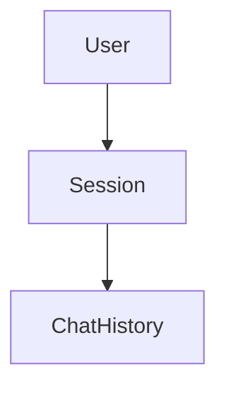
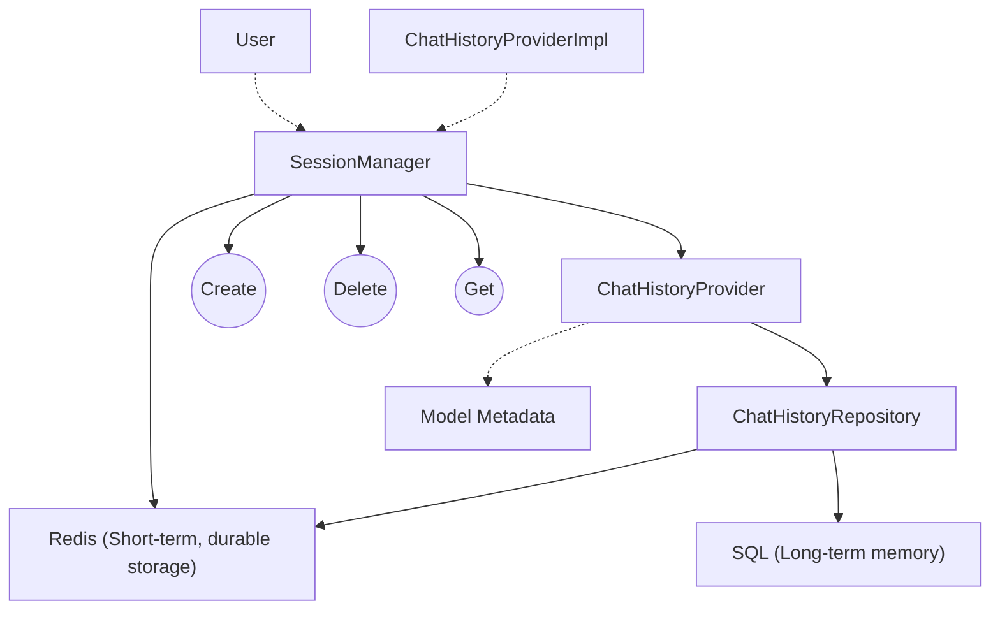
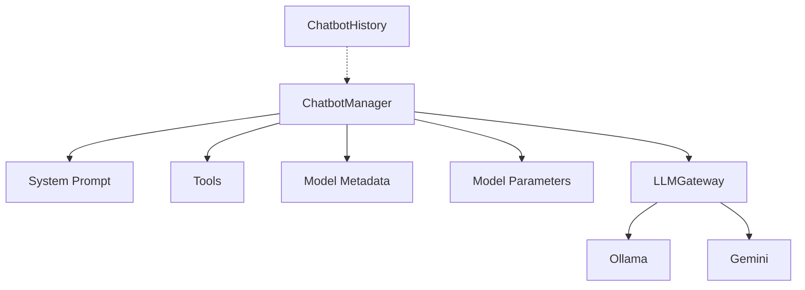

# Chatbot Solution Document

## Relationships

```mermaid
flowchart TD
  User --> Session
  Session --> ChatHistory
```

## Session Manager

```mermaid
flowchart TD

User -.-> SessionManager
ChatHistoryProviderImpl -.-> SessionManager
SessionManager --> ChatHistoryProvider
SessionManager --> Redis

SessionManager --> Create(("Create"))
SessionManager --> Delete(("Delete"))
SessionManager --> Get(("Get"))

ChatHistoryProvider --> ChatHistoryRepository
ChatHistoryProvider -.-> ModelMetadata["Model Metadata"]
ChatHistoryRepository --> Redis["Redis (Short-term, durable storage)"]
ChatHistoryRepository --> SQLite["SQL (Long-term memory)"]


```

## Chatbot Manager

```mermaid
flowchart TD
ChatbotHistory -.-> ChatbotManager
ChatbotManager --> SYS_PROMPT["System Prompt"]
ChatbotManager --> Tools
ChatbotManager --> ModelMetadata["Model Metadata"]
ChatbotManager --> PARAMS["Model Parameters"]
ChatbotManager --> LLMGateway

LLMGateway --> Ollama
LLMGateway --> Gemini

```